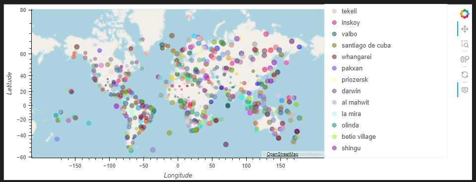
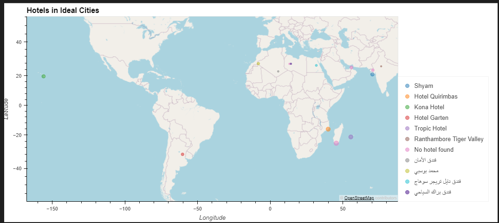

# Python API Challenge

## Overview
This project analyzes weather patterns across cities worldwide and uses the data to plan ideal vacations. It consists of two parts:
1. **WeatherPy**: Visualizes weather data relative to latitude and performs linear regression analysis.
2. **VacationPy**: Maps cities with ideal weather conditions and locates nearby hotels using Geoapify.

## Technologies
- Python
- Pandas
- Matplotlib
- SciPy (Linear Regression)
- Requests (API Handling)
- Jupyter Notebook
- Geoapify API
- OpenWeatherMap API

## Installation
1. Clone the repository:
   ```bash
   git clone https://github.com/Dhruvi267/python-api-challenge.git
   ```
2. Install dependencies:
   ```bash
   pip install pandas matplotlib scipy requests jupyterlab citipy geoviews
   ```
3. Obtain API Keys:
   - [OpenWeatherMap](https://openweathermap.org/api)
   - [Geoapify](https://www.geoapify.com/)
4. Create `api_keys.py` in the root directory with:
   ```python
   weather_api_key = "YOUR_OPENWEATHERMAP_KEY"
   geoapify_key = "YOUR_GEOAPIFY_KEY"
   ```

## Usage
### WeatherPy
1. Run `WeatherPy.ipynb` in Jupyter Notebook.
2. The notebook will:
   - Generate a list of 500+ cities.
   - Fetch weather data from OpenWeatherMap API.
   - Create scatter plots (Latitude vs. Temperature, Humidity, Cloudiness, Wind Speed).
   - Perform linear regression for Northern/Southern Hemispheres.

### VacationPy
1. Run `VacationPy.ipynb` after completing WeatherPy.
2. The notebook will:
   - Load the saved city data CSV.
   - Plot humidity heatmap using GeoViews.
   - Filter cities based on ideal weather (e.g., max temp 21–27°C, wind speed <4.5 m/s, 0% cloudiness).
   - Find the nearest hotel for each city using Geoapify API.
   - Display interactive map with hotel markers.

## Results
### WeatherPy Analysis
- **Temperature vs. Latitude**:  
  
  Strong negative correlation in Northern Hemisphere (r² ≈ 0.75), positive correlation in Southern Hemisphere (r² ≈ 0.54).

- **Humidity/Cloudiness/Wind Speed**:  
  Weak correlations with latitude (r² < 0.2), suggesting other factors dominate.

### VacationPy Output
- **Ideal Weather Cities**:  
   
  Hotels mapped within 10,000 meters of coordinates with hover details.

## Acknowledgments
- Data provided by [OpenWeatherMap](https://openweathermap.org/) and [Geoapify](https://www.geoapify.com/).
- City coordinates generated using [citipy](https://pypi.org/project/citipy/).
- Starter code from Trilogy Education Services.


